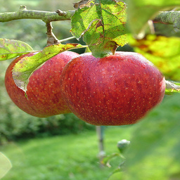
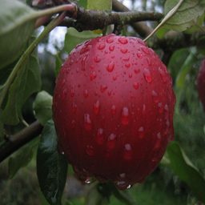
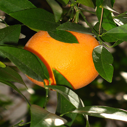
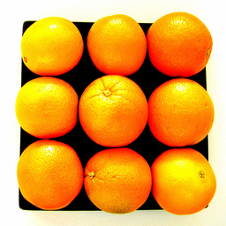
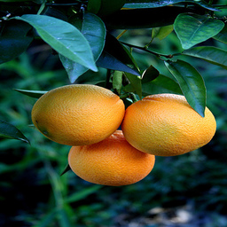
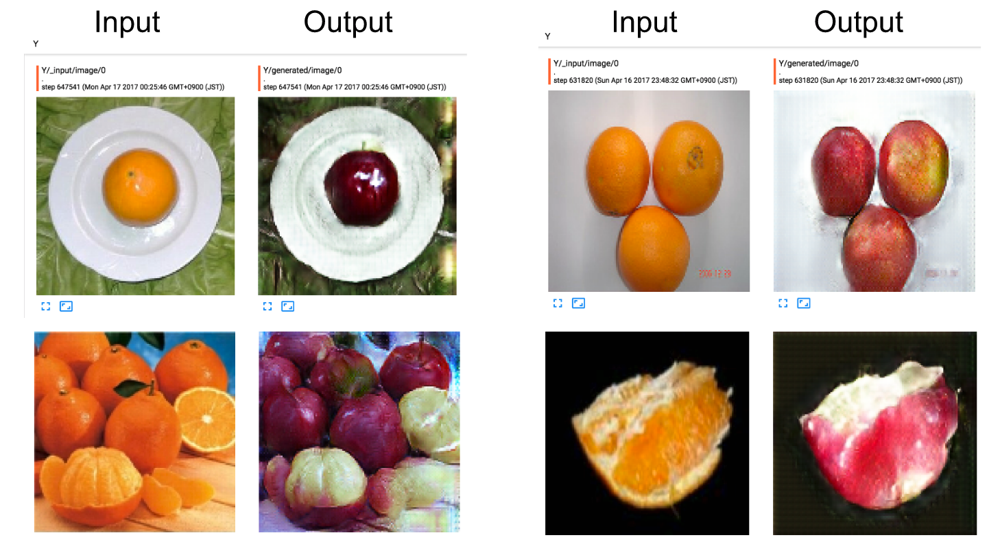

# CycleGAN-TensorFlow
An implementation of CycleGan using TensorFlow.

Original paper: https://arxiv.org/abs/1703.10593

## Results on test data

### apple -> orange

| Input | Output | | Input | Output | | Input | Output |
|-------|--------|-|-------|--------|-|-------|--------|
| | | | | | | | |


### orange -> apple

| Input | Output | | Input | Output | | Input | Output |
|-------|--------|-|-------|--------|-|-------|--------|
| | | | | | | | |

## Environment

* TensorFlow 1.0.0
* Python 3.6.0

## Data preparing

* First, download a dataset, e.g. apple2orange

```bash
$ bash download_dataset.sh apple2orange
```

* Write the dataset to tfrecords

```bash
$ python build_data.py
```

Check `$ python build_data.py --help` if you want to change default paths.

## Training

```bash
$ python train.py
```

If you want to change some default settings, you can pass those to the command line, such as:

```bash
$ python train.py  \
    --X=data/tfrecords/horse.tfrecords \
    --Y=data/tfrecords/zebra.tfrecords
```

Here is the list of arguments:
```
usage: train.py [-h] [--batch_size BATCH_SIZE] [--image_size IMAGE_SIZE]
                [--use_lsgan [USE_LSGAN]] [--nouse_lsgan] [--norm NORM]
                [--lambda1 LAMBDA1] [--lambda2 LAMBDA2]
                [--learning_rate LEARNING_RATE] [--beta1 BETA1]
                [--pool_size POOL_SIZE] [--X X] [--Y Y]

optional arguments:
  -h, --help            show this help message and exit
  --batch_size BATCH_SIZE
                        batch size, default: 1
  --image_size IMAGE_SIZE
                        image size, default: 256

  --use_lsgan [USE_LSGAN]
                        use lsgan (mean squared error) or cross entropy loss,
                        default: True
  --nouse_lsgan
  --norm NORM           [instance, batch] use instance norm or batch norm,
                        default: instance
  --lambda1 LAMBDA1     weight for forward cycle loss (X->Y->X), default: 10.0
  --lambda2 LAMBDA2     weight for backward cycle loss (Y->X->Y), default: 10.0
  --learning_rate LEARNING_RATE
                        initial learning rate for Adam, default: 0.0002
  --beta1 BETA1         momentum term of Adam, default: 0.5
  --pool_size POOL_SIZE
                        size of image buffer that stores previously generated
                        images, default: 50
  --X X
                        X tfrecords file for training,
                        default: data/tfrecords/apple.tfrecords
  --Y Y
                        Y tfrecords file for training,
                        default: data/tfrecords/orange.tfrecords
```

Check TensorBoard to see training progress and generated images.

```
$ tensorboard --logdir checkpoints/${datetime}
```

These are some interesting screenshots from TensorBoard when training orange -> apple:




### Notes
If you observe that background colors of input and generated images are high contrast (e.g. black becomes white), you should restart your training!

## Export model
You can export model from a checkpoint to a standalone GraphDef file as follow:

```bash
$ python export_graph.py --checkpoint_dir checkpoints/${datetime}} \
                         --XtoY_model apple2orange.pb \
                         --YtoX_model orange2apple.pb \
                         --image_size 256
```


## Inference
After exporting model, you can use it to inference as follow:

```bash
python export_graph.py --model pretrained/apple2orange.pb \
                       --input input_sample.jpg \
                       --output output_sample.jpg \
                       --image_size 256
```

## Pretrained models
My pretrained models are available at https://github.com/vanhuyz/CycleGAN-TensorFlow/releases

## Contributing
Please open an issue if you have any trouble or found something incorrect in my code :)

## License
This project is licensed under the MIT License - see the [LICENSE](LICENSE) file for details.

## Acknowledgments

* CycleGAN paper: https://arxiv.org/abs/1703.10593
* Official source code in Torch: https://github.com/junyanz/CycleGAN
